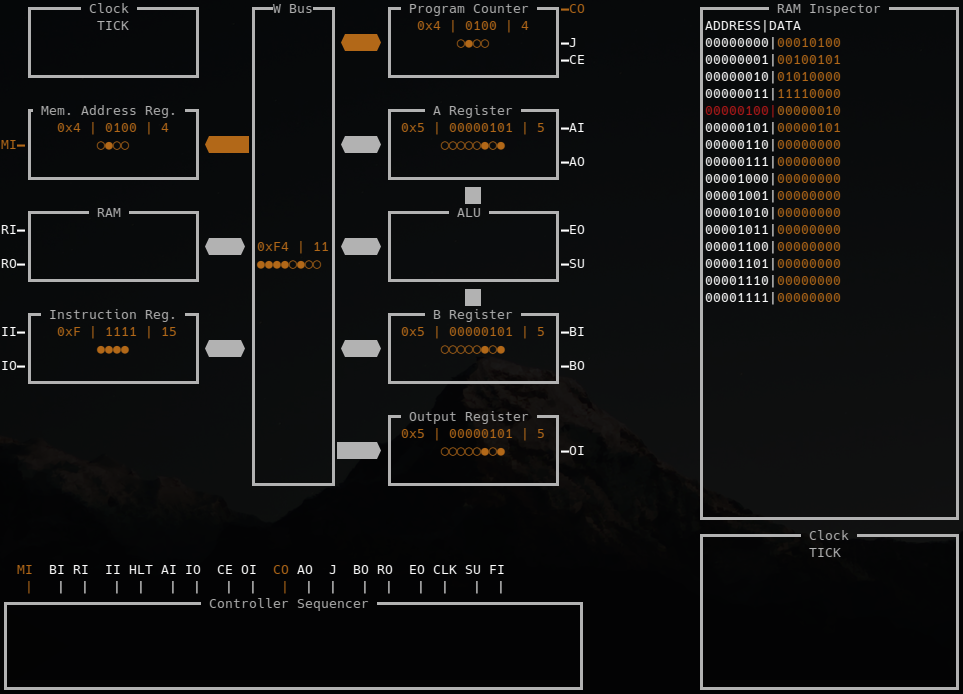

# SAP-X Emulator

A Rust-based emulator for the SAP-X architecture (Ben Eater's design), featuring configurable components. It uses terminal capabilities to render a rich interface for extended interoperability, and visualization.

## Features

- Full SAP-X architecture emulation
- Configurable bus size, clock frequency, memory size
- Step-through instruction execution
- Rich interactable interface

## Getting Started

To run the emulator, simply use Cargo. You can provide (optionally) a bin file that will be injected in the RAM for the program instance.

    cargo run
    
    #or
    
    cargo run /path/to/ramdump.bin
